# Store

My first responsive flutter app (Mobile and Tablet)

  

## Getting Started :rocket:

- Clone the repo
- Install the dependicies
- Run it

## Requirements :computer:

- Any Operating System (MacOS, Linux, Windows)
- Any IDE with Flutter SDK installed (Android Studio, VSCode etc)
- A little knowledge of Dart and Flutter

## Screenshots 📸

- Tablet

| Login | Store |
|----------------|-------------------------------|
|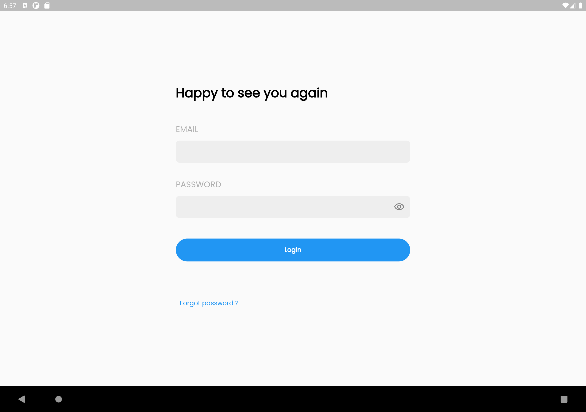|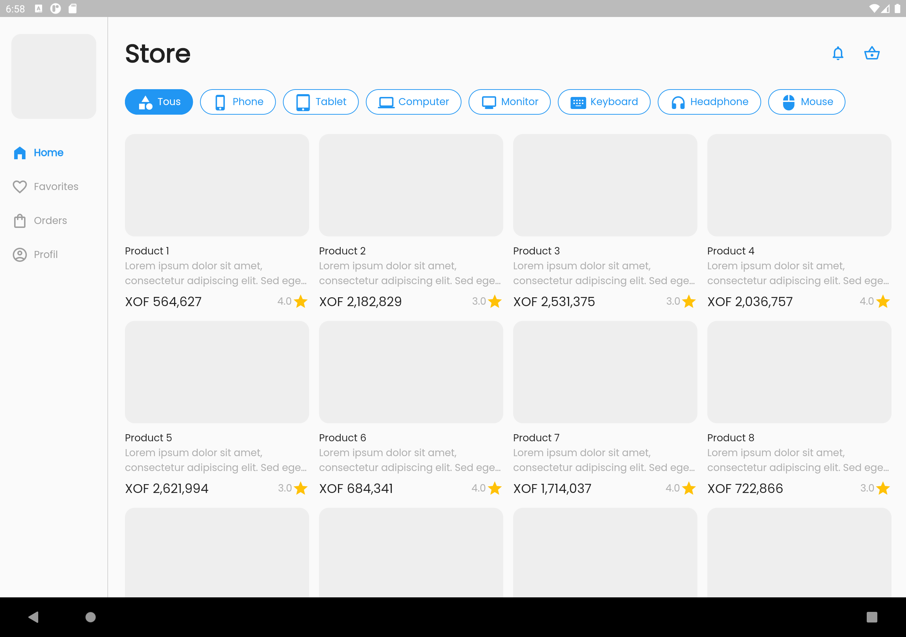|

| Product details (side bar) | Cart |
|----------------|-------------------------------|
|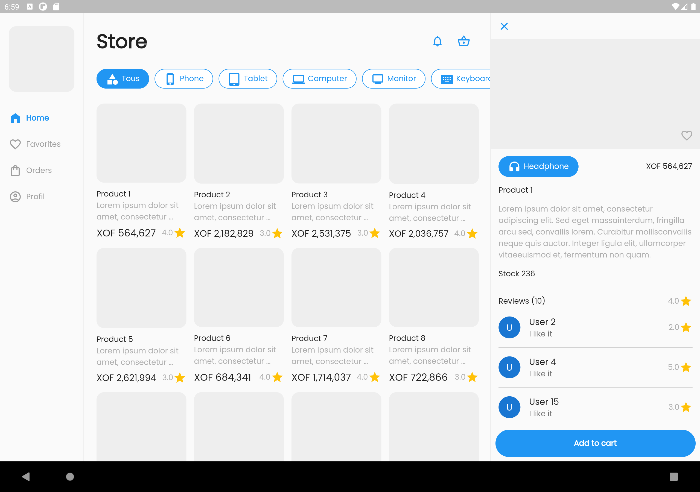|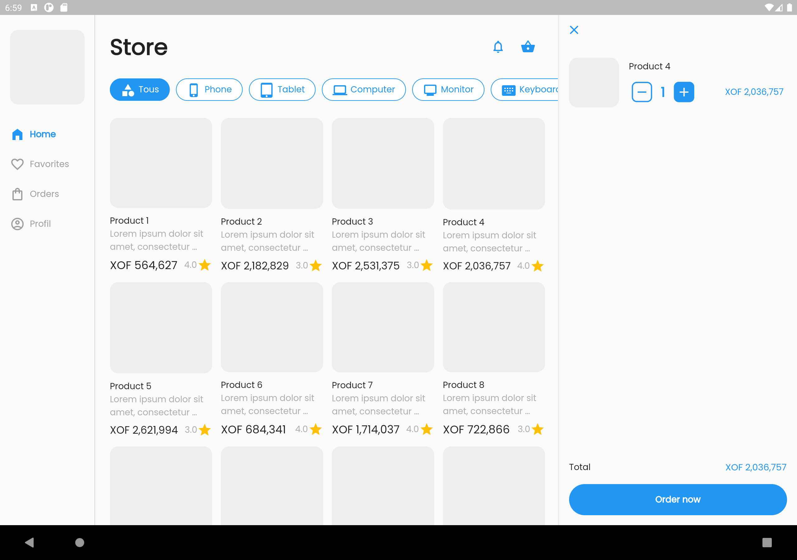|

| Checkout | Payment completed |
|----------------|-------------------------------|
|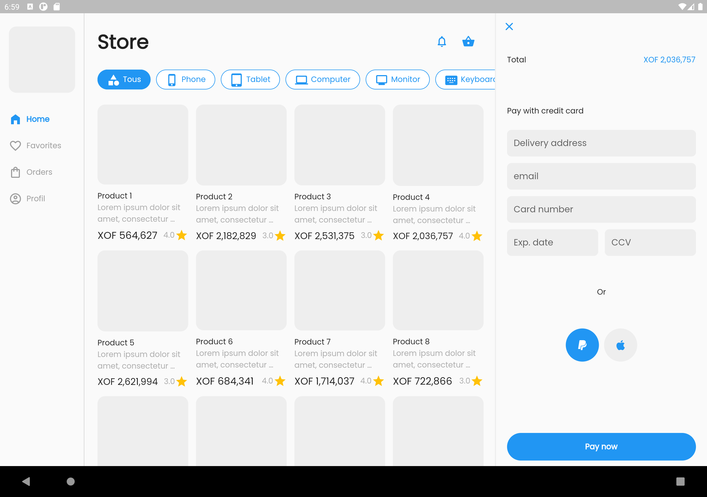|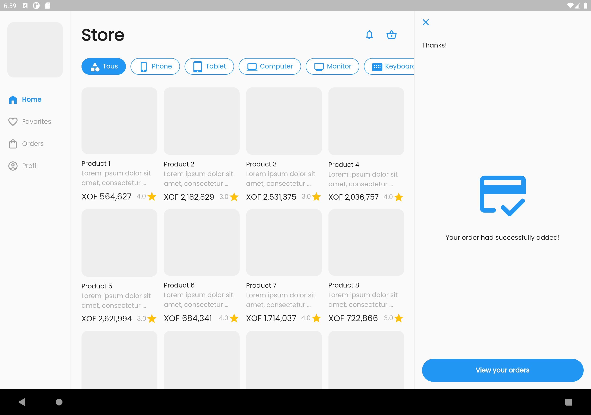|

| Orders | Order details |
|----------------|-------------------------------|
|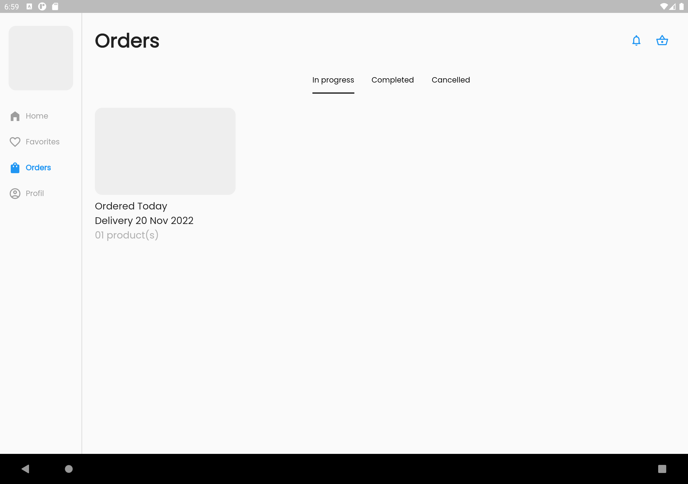|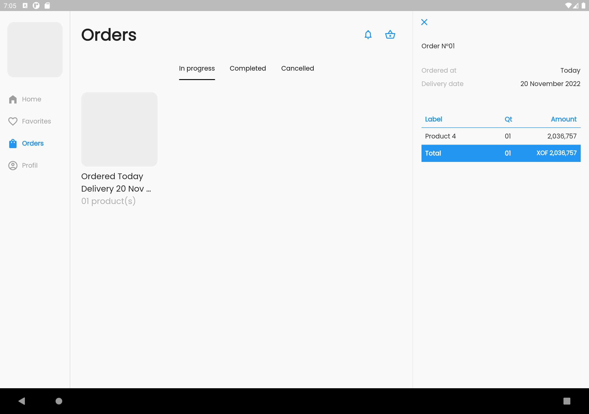|

- Mobile

| Login | Store | Product details |
|----------------|-------------------------------|-----------------------------|
|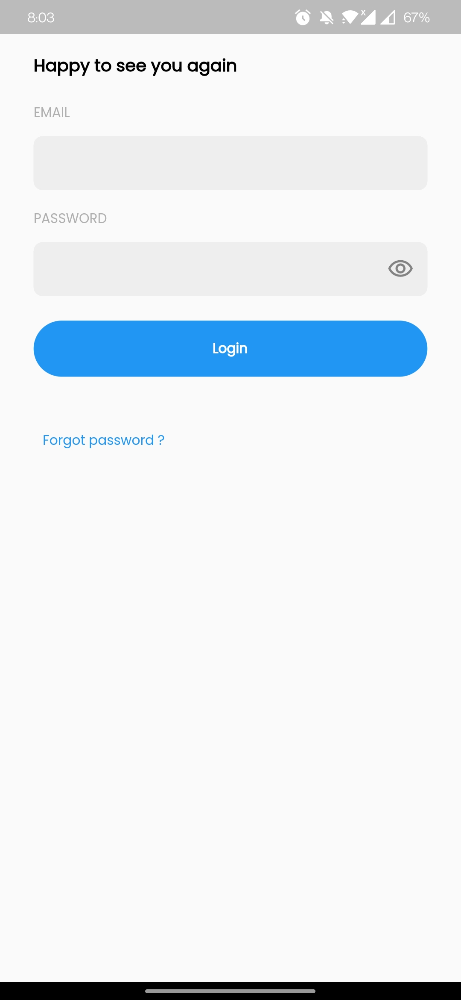|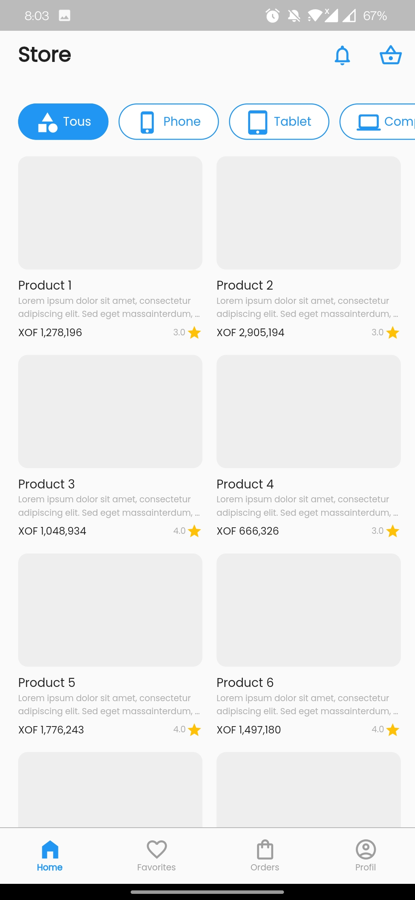|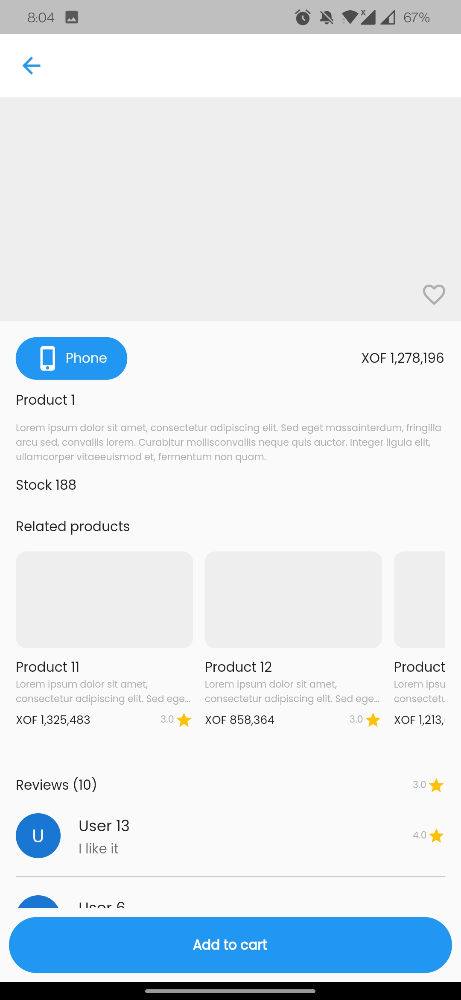            |

| Cart | Checkout | Payment completed |
|----------------|-------------------------------|-----------------------------|
|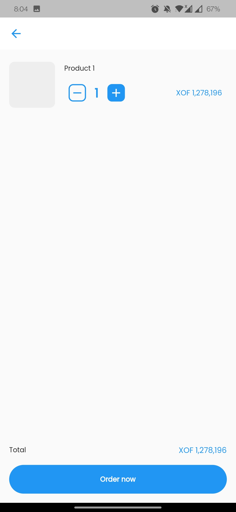|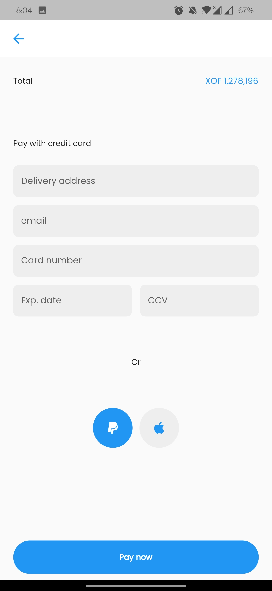|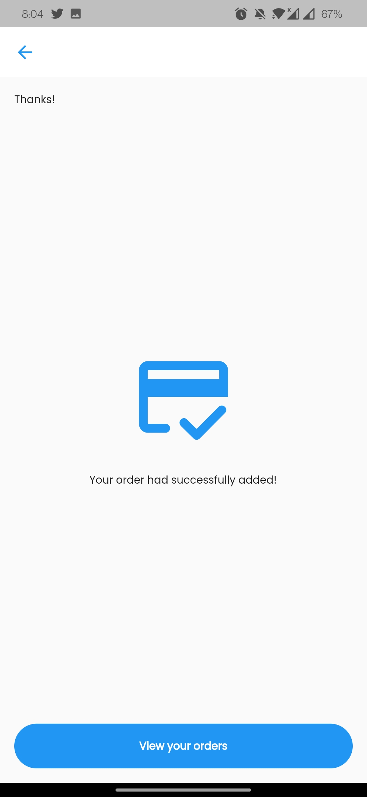            |

| Orders | Order details | Product |
|----------------|-------------------------------|-----------------------------|
|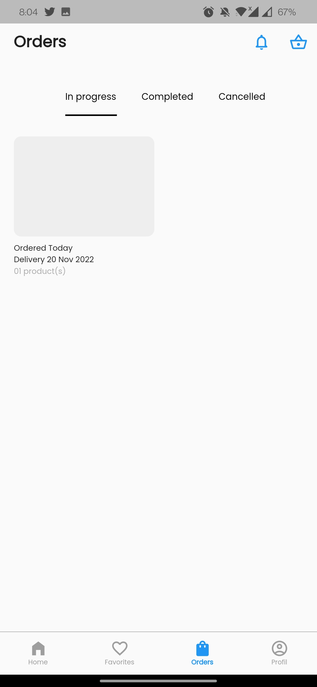|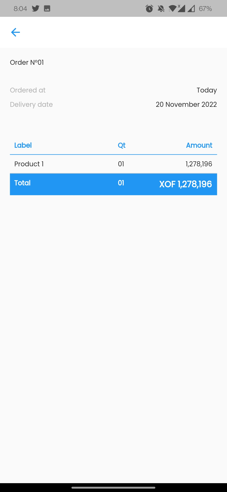|            |